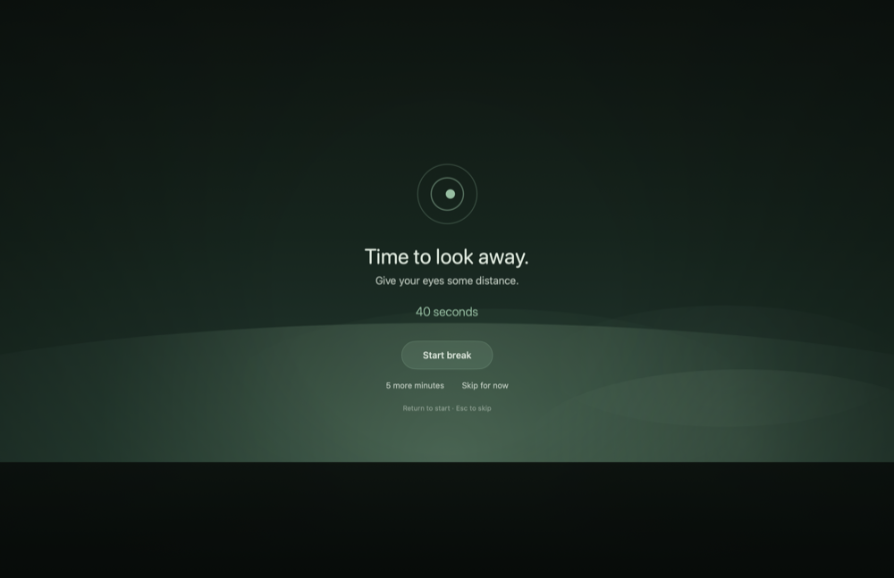
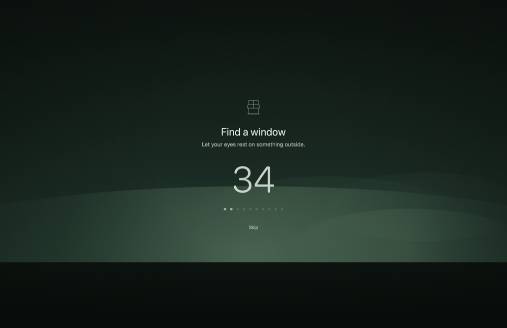

# Glance

A calm eye-break reminder for macOS. It lives in the menu bar, follows the
20-20-20 guideline, and stays quiet when interrupting you would be costly.

The goal is eye health, not productivity scoring. There are no streaks, no
guilt, and no red failure states.





## Build and run

```bash
./build.sh
open build/Glance.app
```

Requires macOS 14 or later and a Swift 5.9+ toolchain. The build produces
`build/Glance.app`, a menu bar only app with no Dock icon. To keep it, move it
to `/Applications` and turn on **Settings → General → Start Glance at login**.

## How it works

A focus timer accumulates screen time. When it reaches your interval, Glance
asks one question before interrupting: *is now a good moment?*

```
FOCUSING ──► break due ──► good moment? ──yes──► BREAK DUE ──► BREAKING ──► COMPLETE
                                │
                                no
                                ▼
                          SMART PAUSED ──context clears──► WAITING TO RESUME ──► BREAK DUE
```

### Smart Pause

Reminders are held back while any of these are true:

| Condition | How it is detected |
|---|---|
| Camera is active | CoreMediaIO's per-device "is running somewhere" flag |
| One of your apps is in front | Frontmost app's bundle identifier |
| Presenting or sharing a screen | Display mirroring, plus full-display windows above the normal window layer |

Screen time **keeps accumulating** during a call, so the break you are owed is
not lost — it arrives shortly after the call ends, after a grace period
(30 seconds by default) so you can finish typing that follow-up.

### Natural breaks

Stepping away already rests your eyes. Idle time under a minute is treated as
thinking and does not count as screen time; idle past your threshold
(3 minutes by default) resets the focus timer entirely, so Glance does not
ambush you the moment you sit back down.

## Colour, and why the break is green

Glance uses two palettes on purpose.

**Indigo → violet → lavender** is the focus identity: the app icon, the menu bar
ring, the popover. It is small, and it is only ever on screen for a moment.

**Deep forest green** is the break. The overlay fills an entire display for the
length of a break, so it is the one surface where eye comfort outranks branding:

- **Green, not blue.** Short wavelengths focus slightly in front of the retina,
  so a large blue-violet field leaves the eye hunting for focus. Green sits at
  the peak of human luminous sensitivity, so it reads clearly at much lower
  intensity.
- **Low luminance.** Roughly half the perceived brightness of the indigo field
  it replaced, so a break is a step down from work rather than a flash.
- **Low contrast.** Copy is a soft off-white with a green cast rather than pure
  white, and the horizon is a dim wash rather than a glow, so nothing in the
  frame pulls your eye back to the screen.

The result is a surface you can look straight at for twenty seconds without it
costing you anything — while the copy still asks you to look somewhere else.

## Privacy

Glance never records your camera, microphone, screen, or meetings. It reads
whether the camera is switched on, which app is frontmost, and the size and
layer of on-screen windows. It requests no TCC permissions, and nothing leaves
your Mac.

## Cost while it runs

Glance is a background app, so this is measured rather than assumed. On an
M2 MacBook Air, CPU time consumed by the Glance process itself:

| State | CPU |
|---|---|
| Focusing (no overlay) | under 1% of a core |
| Break, motion on | ~29% of a core, for the length of the break |
| Break, reduced motion | ~1.5% of a core |
| Break, each secondary display | ~1.5% of a core |

At the 20-20-20 default a break is 20 seconds out of every 20 minutes, so the
animated overlay averages out to well under 1% of a core.

The expensive part turned out not to be the drifting backdrop. It was the
countdown's glyph-morphing transition and the dot fades, which kept a
full-screen SwiftUI view re-compositing at display refresh rate; both are now
tied to the motion setting. Displays that show no controls draw a still
backdrop for the same reason.

Two things measured but not fixed, stated plainly: there is a several-second
CPU burst when the overlay windows are first presented, which needs Instruments
to attribute properly; and memory was observed flat over minutes, which is not
the same as a soak test over days.

## Known limits

- **Presentation detection is a heuristic.** macOS exposes no public "my screen
  is being captured" flag. Glance infers it from display mirroring and from
  full-display windows above the normal window layer, which covers Keynote and
  PowerPoint slideshows, AirPlay, projectors, and the border overlays that Zoom
  and Teams draw while sharing. It will not catch every screen share. Adding the
  app to the Smart Pause app list is the reliable fallback.
- **Microphone use is not detected.** Audio-only calls with the camera off need
  the app in the Smart Pause list.
- **Launch at login needs a stable code signature.** The ad-hoc signature from
  `build.sh` works on most systems but may need re-approving after a rebuild.

## Layout

```
Sources/Glance/
  Core/
    BreakEngine.swift        focus timer and interruption rules
    ContextEngine.swift      "is now a good moment?"
    GlanceSettings.swift     preferences
    BreakActivity.swift      the rotating break prompts
    SessionLog.swift         breaks taken today
  Detection/
    CameraMonitor.swift      CoreMediaIO camera state
    PresentationMonitor.swift  mirroring and slideshow/sharing windows
    AppMonitor.swift         frontmost app
    IdleMonitor.swift        seconds since last input
  UI/
    GlanceApp.swift          entry point
    DesignSystem.swift       both palettes and the horizon backdrop
    BreakOverlayView.swift   the three break phases
    OverlayController.swift  full-screen windows on every display
    MenuBarIcon.swift        the progress ring
    PopoverView.swift        menu bar popover
    SettingsView.swift       settings
Tools/make-icon.swift        renders the app icon
```
