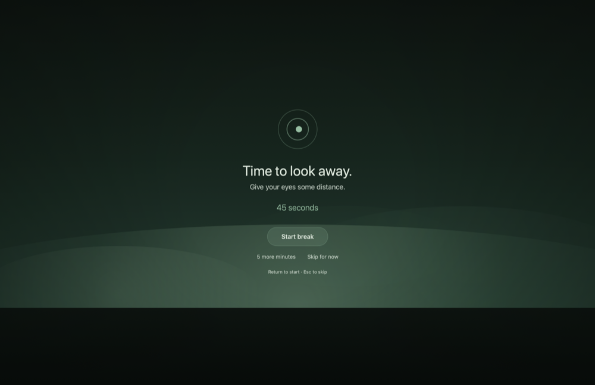

# Glance

A calm eye-break reminder for macOS. It lives in the menu bar, follows the
20-20-20 guideline, and stays quiet when interrupting you would be costly.




## Install

```bash
./build.sh && open build/Glance.app
```

macOS 14+. No Dock icon, no windows — just a ring in the menu bar that fills as
screen time adds up. To keep it, move `Glance.app` to `/Applications` and turn
on **Settings → General → Start Glance at login**.

## Using it

Every 20 minutes Glance offers a 20-second break and fills the screen with a
soft green horizon — light by day, dark at night, following your system
appearance. See [why green, and why it changes](#why-it-looks-like-that).

- **Return** starts the break, **Esc** skips it. Untouched, it starts on its own
  after 10 seconds, so it still works if you have already walked away.
- **5 more minutes** defers one cycle. **Pause for 1 hour** in the menu bar
  popover silences it properly, with a Resume button.
- On several displays, the one under your pointer gets the controls; the rest
  show a still backdrop.
- Honours the system Reduce Motion setting, not just its own.

## Why it looks like that

The break fills a whole display, so the palette is taken from the visual
ergonomics literature rather than from branding.

**Match the room rather than fight it.** Comfort guidance puts the
screen-to-surround luminance ratio at [around 3:1 or under](https://us.ktcplay.com/blogs/support-tips/ergonomic-brightness-monitor-contrast-eye-comfort):
the strain is in the size of the adaptation jump, in either direction. A
near-black overlay is a big jump for someone working in a lit room, so Glance
follows the system appearance instead of always going dark.

**Light beats dark for most eyes.** A dark field dilates the pupil and admits
more optical aberration; NN/g found [positive polarity won on every dimension,
with reading speed dropping up to 26% on negative polarity](https://www.nngroup.com/articles/dark-mode/),
and light-on-dark text haloes for the 30–50% of adults with astigmatism. Dark
wins in a genuinely dim room — which is when the system is already in dark mode.

**Green specifically.** A [2025 reading study](https://www.frontiersin.org/journals/psychology/articles/10.3389/fpsyg.2025.1627013/full)
found a light green ground raised pupil diameter — a marker of *lower* fatigue —
lowered negative affect, and improved reading performance against white.

**Not because of blue light.** A [2023 Cochrane review of 17 trials](https://www.cochranelibrary.com/cdsr/doi/10.1002/14651858.CD013244.pub2/full)
found blue-filtering lenses make no reliable difference to eye strain. The
mechanisms that do matter are [reduced blinking and sustained near focus](https://pmc.ncbi.nlm.nih.gov/articles/PMC9434525/),
which is what looking into the distance and blinking deliberately are for.

Override it under **Settings → General → Break appearance**.

## Smart Pause

Reminders are held — never dropped — while any of these are true:

| Condition | How it is detected |
|---|---|
| Camera is active | CoreMediaIO's per-device "running somewhere" flag |
| A chosen app is frontmost | Frontmost bundle identifier; you pick the apps |
| Presenting or screen sharing | Display mirroring, plus full-display windows above the normal window layer |

Screen time keeps counting during a call, so the break arrives about 30 seconds
after it ends rather than being lost. Glance pays exactly one break back, not a
stack of missed ones.

Stepping away already rests your eyes: idle under a minute still counts as
screen time, past a minute the timer holds, and past your threshold (3 minutes
by default) it starts over — so you are not ambushed the moment you sit down.

## Cost while it runs

This is a background app, so the numbers are measured rather than assumed.
CPU consumed by the Glance process on an M2 MacBook Air:

| State | CPU |
|---|---|
| Focusing (no overlay) | under 1% of a core |
| Break, motion on | ~29% of a core, for the break's duration |
| Break, reduced motion | ~1.5% of a core |
| Break, per secondary display | ~1.5% of a core |

At the 20-20-20 default that is 20 seconds in every 20 minutes, so the overlay
averages well under 1% of a core.

The expensive part was not the drifting backdrop. It was the countdown's
glyph-morphing transition and the dot fades, which kept a full-screen SwiftUI
view re-compositing at display refresh rate; both are now tied to the motion
setting, which took a break from ~29% to ~1.5%.

## Privacy

Glance never records your camera, microphone, screen, or meetings, and nothing
leaves your Mac. To know when to stay quiet it reads whether a camera is
switched on, which app is in front, and the size and layer of on-screen windows
— enough to spot a slideshow, never its contents. It requests no permissions.

## Limits

- **Presentation detection is a heuristic.** macOS exposes no public "my screen
  is being captured" flag. Glance infers it from display mirroring and
  full-display windows above the normal layer, which covers Keynote and
  PowerPoint slideshows, AirPlay, projectors, and the border overlays Zoom and
  Teams draw while sharing. It will not catch every screen share; adding the app
  to the Smart Pause list is the reliable fallback.
- **Microphone use is not detected.** Audio-only calls with the camera off need
  the app in the Smart Pause list.
- **Launch at login needs a stable code signature.** The ad-hoc signature from
  `build.sh` works on most systems but may need re-approving after a rebuild.
- Two things measured but unresolved: a several-second CPU burst when the
  overlay windows are first presented, which needs Instruments to attribute;
  and memory looked flat over minutes, which is not a soak test.

## License

MIT
